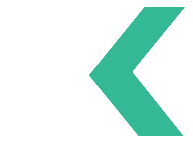
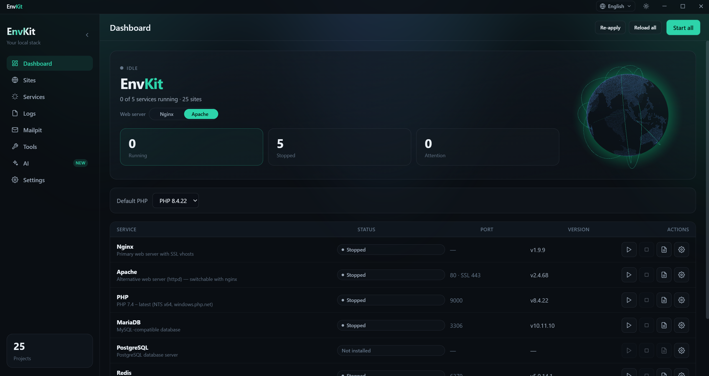
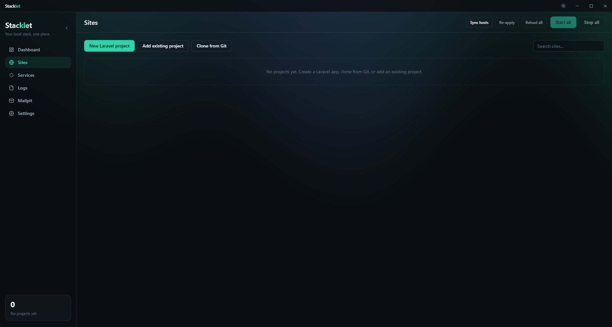
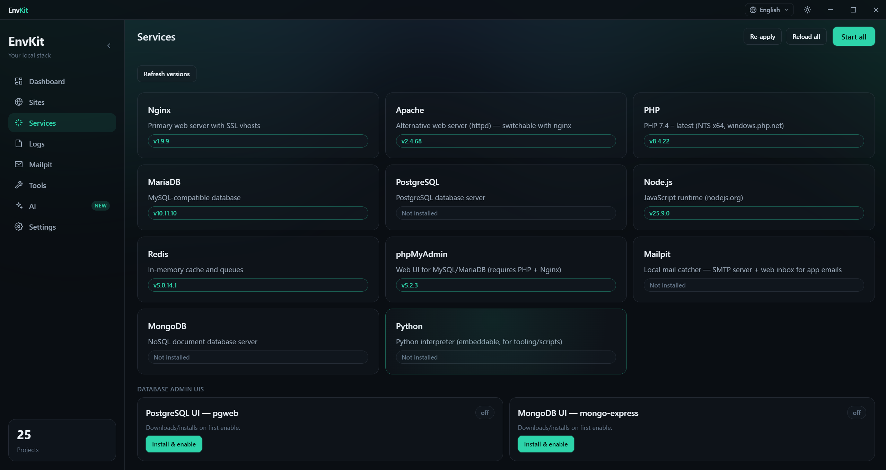
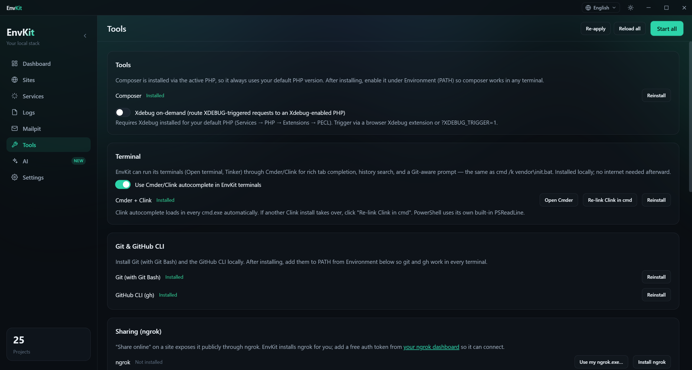
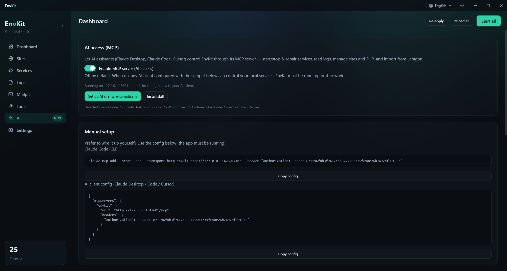
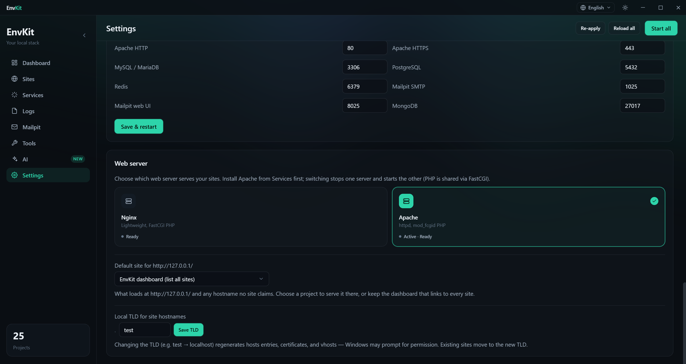

# EnvKit — local development environment for Windows & macOS

**Your local stack, one place.** A free Laragon / XAMPP / Herd alternative.

EnvKit is a desktop app that runs your entire local web-development stack — nginx **or**
Apache, multiple PHP versions, MySQL/MariaDB, PostgreSQL, Redis, MongoDB, Mailpit, Node.js,
Python, phpMyAdmin, trusted `.test` HTTPS, and PATH sync — from one modern tray app. Build
Laravel, WordPress, PHP, and Node/React/Next.js sites locally with one-click services and
trusted local SSL. It can even be **driven by an AI assistant** (Claude Code / Desktop, Cursor,
Windsurf, VS Code, Zed, OpenCode, Gemini CLI) through a built-in MCP server.

---

> **This repository is the public home for EnvKit releases & documentation.** Visit the [**website**](https://envkit.net/) for features, screenshots, and comparisons, or grab the
> installer from the [**Releases**](https://github.com/Env-Kit/envkit-releases/releases/latest)
> page. The application source is maintained privately.

## What's new

- **macOS support** — EnvKit now ships a signed app for **Apple Silicon (arm64)** and
  **Intel (x64)** Macs, with the same one-click stack, `.test` HTTPS, and AI/MCP control.
- **MySQL 8** — install Oracle MySQL 8 side-by-side with MariaDB; each version lives in its
  own directory.
- **Custom versions** — type any version of MySQL/MariaDB, nginx, Node.js, MongoDB, or Redis
  and EnvKit installs it for you.
- **Self-healing & resilient downloads** — service archives are mirrored on GitHub (no more
  broken installs when an upstream moves), and a corrupt services manifest repairs itself.
- **Faster, cancellable installs** — non-blocking extraction (no UI freeze) and a **Stop**
  button on every install.

## Install

### Windows

Download the latest **`EnvKit-Setup-x.y.z.exe`** from the
[releases page](https://github.com/Env-Kit/envkit-releases/releases/latest) and run it.
(SmartScreen may warn on first run — **More info → Run anyway**; EnvKit is self-signed.)

### macOS

Download the matching DMG for your Mac from the
[releases page](https://github.com/Env-Kit/envkit-releases/releases/latest):

- **Apple Silicon (M1/M2/M3/M4):** `EnvKit-x.y.z-arm64.dmg`
- **Intel:** `EnvKit-x.y.z-x64.dmg`

Open the DMG and drag **EnvKit** to Applications. On first launch, **right-click the app →
Open** (or run `xattr -dr com.apple.quarantine /Applications/EnvKit.app`) to get past
Gatekeeper — the app is Developer-ID signed; notarization is on the way.

EnvKit **auto-updates** on both platforms: once installed, it checks GitHub for new releases
and installs them in place (Settings → Updates lets you check/download manually). On first
launch a short **onboarding wizard** asks your source — **Load from Laragon** (a guided
detect → import flow, including databases) or **Start fresh** (pick your stack and install
the runtimes it needs).

Upgrading from a previous version? Your data directory, certificates, and settings are
**migrated automatically** on first launch — nothing to do.

## Requirements

- Windows 10 / 11, or
- macOS 12 Monterey or later (Apple Silicon or Intel)

## Screenshots

**Dashboard**

**Sites**

**Services**

**Tools**

**AI (MCP)**

**Settings**

## Highlights

- **Windows _and_ macOS** — one app, the same stack on both (signed builds for Apple Silicon
  + Intel).
- **nginx _or_ Apache**, switchable in Settings — PHP via FastCGI on both.
- **Trusted `.test` HTTPS** for every site via an auto-installed local CA.
- **Multiple PHP versions** with **per-site isolation** and **Xdebug on-demand**.
- **Bundled databases & tools** — MySQL/MariaDB (incl. **MySQL 8**), PostgreSQL, Redis,
  **MongoDB**, **Mailpit**, Node.js, **Python**, phpMyAdmin, plus Composer/Git/gh/nvm/ngrok/Cmder
  installers.
- **Custom versions** — install an arbitrary typed version of MySQL/MariaDB, nginx, Node.js,
  MongoDB, or Redis.
- **Node / React / Next.js dev sites** reverse-proxied at `.test` HTTPS with **hot-reload**.
- **Laravel Reverb (WebSockets)** — one-click install, supervise, and proxy per site.
- **Import from Laragon** — projects **and** databases (incl. MySQL → MariaDB transfer).
- **Diagnose & self-heal services** — find port conflicts / stale PIDs / bad configs and
  repair them.
- **AI control via MCP** — let Claude Code/Desktop, Cursor, Windsurf, VS Code, Zed, OpenCode,
  or Gemini CLI operate your stack: add/remove sites, manage MySQL databases, start/stop and
  diagnose services.
- **Clean PATH, your way** — sync to the **user** or **system (Machine)** PATH, with stale
  entries pruned and **competing stacks (Laragon/XAMPP/WAMP/MAMP/Herd…) auto-removed** so
  nothing shadows EnvKit's `php`/`mysql`/`nginx`.
- **Light/dark, fully translated (EN + AR, RTL)** native UI in the tray.
- **Free to use** (proprietary — not open source) with **silent auto-update**.

## How EnvKit compares

A best-effort snapshot (mid-2026) against other popular local PHP stacks.

| Feature | **EnvKit** | Laravel Herd | Laragon | AppServ | XAMPP |
|---|:---:|:---:|:---:|:---:|:---:|
| Platform | Windows **+** macOS | macOS, Windows | Windows | Windows | Win / macOS / Linux |
| Price / license | Free · proprietary | Free + paid Pro | Free | Free | Free |
| Web server | nginx **+** Apache | nginx | Apache + nginx | Apache | Apache |
| Multiple PHP versions | ✅ | ✅ | ✅ | ❌ | ❌ |
| Per-site PHP isolation | ✅ | ✅ | 🟡 | ❌ | ❌ |
| Auto `.test` domains | ✅ | ✅ | ✅ | ❌ | ❌ |
| Trusted local HTTPS | ✅ | ✅ | ✅ | ❌ | 🟡 manual |
| MySQL / MariaDB | ✅ | 💲 Pro | ✅ | ✅ | ✅ |
| PostgreSQL | ✅ | 💲 Pro | 🟡 | ❌ | ❌ |
| Redis | ✅ | 💲 Pro | 🟡 | ❌ | ❌ |
| MongoDB | ✅ | ❌ | 🟡 | ❌ | ❌ |
| DB web admin UIs (Postgres/Mongo) | ✅ | ❌ | ❌ | ❌ | ❌ |
| Mail catcher (Mailpit) | ✅ | 💲 Pro | ❌ | ❌ | 🟡 Mercury |
| Node.js | ✅ | 🟡 | ✅ | ❌ | ❌ |
| Node/React/Next.js dev sites | ✅ | 🟡 | 🟡 | ❌ | ❌ |
| Laravel Reverb (WebSockets) | ✅ | 🟡 | ❌ | ❌ | ❌ |
| nvm + per-project `.nvmrc` | ✅ | ❌ | ❌ | ❌ | ❌ |
| Python | ✅ | ❌ | 🟡 | ❌ | ❌ |
| Composer / Laravel scaffolding | ✅ | ✅ | ✅ | ❌ | ❌ |
| Light / dark UI | ✅ | ✅ | 🟡 | ❌ | ❌ |
| Multi-language UI (+ RTL) | ✅ | ❌ | 🟡 | ❌ | ❌ |
| Import from Laragon (projects **+ databases**) | ✅ | ❌ | — | ❌ | ❌ |
| AI control via MCP | ✅ | ❌ | ❌ | ❌ | ❌ |
| Diagnose & self-heal services | ✅ | ❌ | ❌ | ❌ | ❌ |
| Auto-update | ✅ | ✅ | 🟡 | ❌ | ❌ |

✅ built-in · 🟡 partial / via add-on · ❌ not available · 💲 paid tier

## AI access (MCP)

EnvKit ships an MCP server so AI assistants can operate your local stack.

1. Open **Settings → AI** and toggle **Enable MCP server**.
2. Click **Set up AI clients** — EnvKit registers itself **globally** with Claude Code /
   Desktop, Cursor, Windsurf, VS Code, Zed, OpenCode, and Gemini CLI, and installs an
   `envkit` skill. (Or copy the shown URL config into your client's `mcpServers` yourself.)
3. **Restart your AI client**, then ask things like *"start redis"*, *"diagnose why mysql
   won't start, then repair it"*, or *"list my Laravel sites"*.

The endpoint is local-only (`http://127.0.0.1:<port>/mcp`), bearer-token authenticated, off
by default, and only works while EnvKit is running.

## Reporting issues

Found a bug or have a feature request?
[Open an issue](https://github.com/Env-Kit/envkit/issues). Please include your OS and
version, EnvKit version, and steps to reproduce.

For anything else, reach us at [info@envkit.net](mailto:info@envkit.net).

## Team

EnvKit is built and maintained by:

- **Ziad Talaat** — [@zsnakeee](https://github.com/zsnakeee)
- **Kirlos Osama** — [@ker00sama-dev](https://github.com/ker00sama-dev)
- **Youssef Yasser** — [@7aWy11](https://github.com/7aWy11)

## License

**EnvKit is free to use**, but it is **not open source**. All rights reserved.

EnvKit · <a href="https://github.com/Env-Kit">Env-Kit</a>

